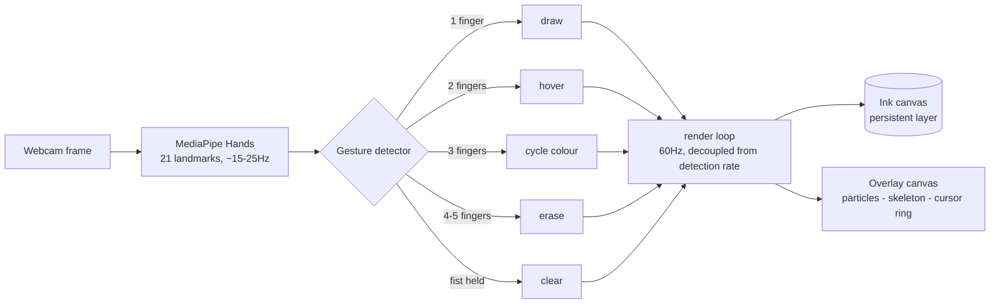
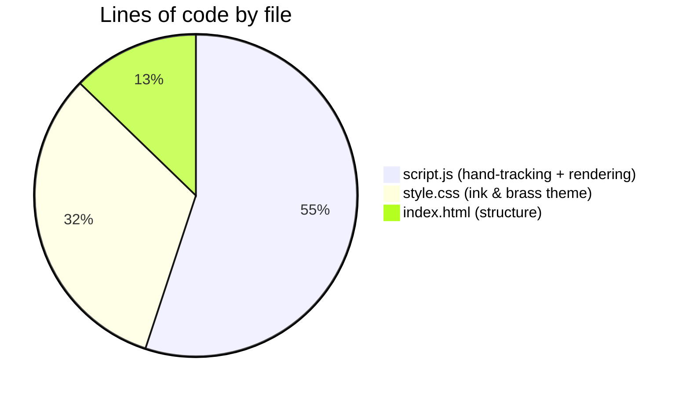

<p align="center">
  
  
  
  
</p>

<p align="center"><em>Point your index finger at your webcam. It becomes a glowing calligraphy nib.<br/>No stylus, no tablet, no backend — just a browser and a hand.</em></p>

---

## Contents

- [What it does](#what-it-does)
- [Hand-signs](#hand-signs)
- [Effects & toggles](#effects--toggles)
- [How it works](#how-it-works)
- [Why it stays fast](#why-it-stays-fast)
- [Codebase](#codebase)
- [Getting started](#getting-started)
- [Deploying to GitHub Pages](#deploying-to-github-pages)
- [Browser support](#browser-support)
- [Roadmap](#roadmap)
- [Credits](#credits)

---

## What it does

**Inkling** turns your webcam into an air-writing canvas. [MediaPipe Hands](https://developers.google.com/mediapipe) tracks 21 points on your hand, entirely on-device — your video never leaves the browser tab. A small state machine reads finger poses as gestures, and a 60fps render loop turns your fingertip's motion into glowing, tapering ink.

It's a static site: three files (`index.html`, `style.css`, `script.js`), zero build step, deployable anywhere that serves plain HTML — including free, forever, on GitHub Pages.

> 🎥 **Add your own demo here.** Record a short screen capture of yourself drawing (GIF or MP4) and drop it in `assets/demo.gif`, then reference it right under this line — a real clip of the kaleidoscope or dissolve mode in action sells the project far better than any description.

## Hand-signs

| Gesture | Hand | Action | Notes |
|---|:---:|---|---|
| One finger up | ☝️ | **Draw** | Index fingertip is the nib; speed changes stroke width |
| Two fingers | ✌️ | **Hover** | Move the cursor without laying ink |
| Three fingers | 🤟 | **Cycle colour** | Advances through the palette once per gesture |
| Open palm (4–5) | 🖐️ | **Erase** | Wipes ink in a radius around your fingertip |
| Fist, held ~1s | ✊ | **Clear canvas** | A progress ring fills around your hand as you hold it |

## Effects & toggles

| Control | What it does | Why it's fun |
|---|---|---|
| **Ink colour** | 5-colour palette, pick by hand gesture or click | Classic tool, no surprises |
| **Nib size** | Base stroke width | Combines with velocity for the calligraphy feel |
| **Glow trail** | Adds a soft bloom around every stroke | Makes ink feel luminous rather than flat |
| **Skeleton** | Overlays the raw MediaPipe hand landmarks | Useful for debugging gesture detection |
| **Kaleidoscope** | Mirrors every stroke into a 12-way radial pattern | Turns doodles into mandalas in real time |
| **Dissolve** | Old ink slowly fades back to black | Looks like writing in water instead of on paper |

## How it works



Detection and drawing are deliberately split into two loops that run at different speeds:

```mermaid
sequenceDiagram
    participant Cam as Webcam
    participant MP as MediaPipe (~15-25Hz)
    participant State as Shared state
    participant Loop as Render loop (60Hz)
    participant Ink as Ink canvas

    Cam->>MP: frame
    MP->>State: landmarks + gesture
    loop every animation frame
        Loop->>State: read latest target position
        Loop->>Loop: smooth/interpolate toward it
        Loop->>Ink: draw only the new segment
    end
```

The smoothing step does double duty: it fills in the visual gaps between MediaPipe's relatively infrequent detections *and* damps out hand-tracking jitter, both for free.

## Why it stays fast

Earlier versions of this project redrew the entire stroke history every single frame — the longer you drew, the slower it got. The current renderer draws **incrementally**: each frame paints only the new bit of line since the last one, directly onto a persistent canvas.

| Approach | Cost per frame | Behaviour over a long session |
|---|---|---|
| Full redraw (v1) | O(total points ever drawn) | Frame time grows the longer you draw |
| Incremental (current) | O(new segment only) | Stays flat, however long you've been drawing |

Erasing follows the same principle — a `destination-out` composite operation removes pixels directly, instead of filtering every stored point on every frame.

## Codebase



| File | Role |
|---|---|
| `index.html` | Page structure, MediaPipe CDN script tags, UI markup |
| `style.css` | The "ink & brass" visual theme — palette, HUD, help drawer, animations |
| `script.js` | Gesture detection, render loop, drawing engine, camera bootstrap |

## Getting started

No install, no build step — any static file server works:

```bash
git clone https://github.com/<your-username>/inkling.git
cd inkling
python3 -m http.server 8080
# open http://localhost:8080
```

Camera access needs `http://localhost` or `https://` — it won't work opened directly as a `file://` path.

## Deploying to GitHub Pages

```bash
git init
git add index.html style.css script.js README.md assets
git commit -m "Inkling: air-writing studio"
git branch -M main
git remote add origin https://github.com/<your-username>/inkling.git
git push -u origin main
```

Then in the repo: **Settings → Pages → Source: Deploy from a branch → `main` / `(root)` → Save**. It'll be live within a minute at `https://<your-username>.github.io/inkling/`. GitHub Pages serves HTTPS by default, which `getUserMedia()` camera access requires.

## Browser support

| Browser | Support |
|---|---|
| Chrome / Edge (desktop) | ✅ Full support, best performance |
| Firefox (desktop) | ✅ Supported |
| Safari (desktop, recent) | ✅ Supported |
| Mobile browsers | ⚠️ Works on some devices; hand tracking is CPU-heavy on phones, expect lower framerate |

## Roadmap

| Status | Idea |
|:---:|---|
| ✅ | Core air-writing engine with 5 gestures |
| ✅ | Decoupled 60fps render loop, incremental drawing |
| ✅ | Kaleidoscope and ink-dissolve modes |
| 🔜 | Two-hand support (draw with one, menu with the other) |
| 🔜 | Pinch-to-tap toolbar buttons, no keyboard/mouse at all |
| 🔜 | Export the stroke sequence as an animated GIF, not just a flat PNG |
| 💭 | Undo via a held gesture |

## Credits

- Hand tracking: [MediaPipe Hands](https://developers.google.com/mediapipe/solutions/vision/hand_landmarker) (Google)
- Fonts: [Fraunces](https://fonts.google.com/specimen/Fraunces), [Space Grotesk](https://fonts.google.com/specimen/Space+Grotesk), [JetBrains Mono](https://www.jetbrains.com/lp/mono/) (Google Fonts)
- Built and hosted entirely client-side — no server, no data collection

---

<p align="center"><sub>Made with a webcam and too much enthusiasm for hand gestures. ✍️</sub></p>
